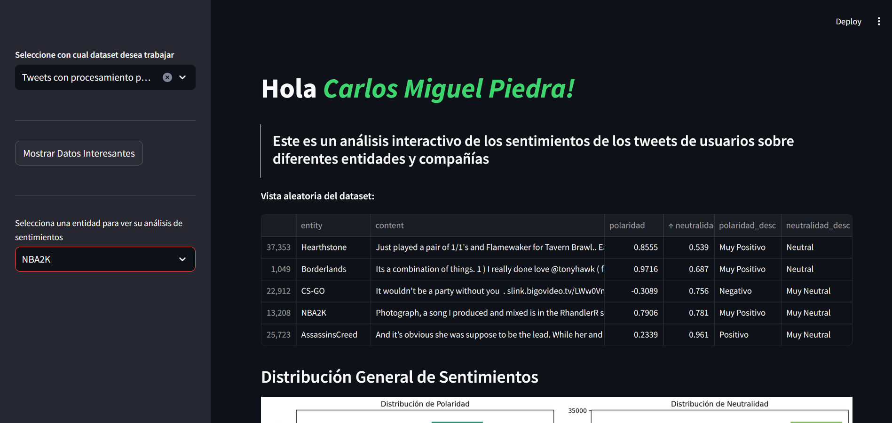
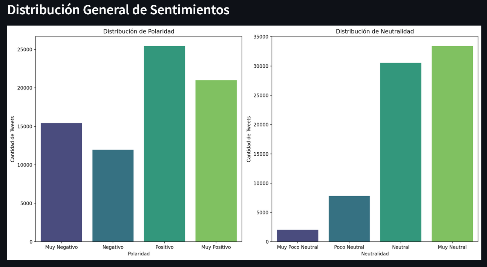
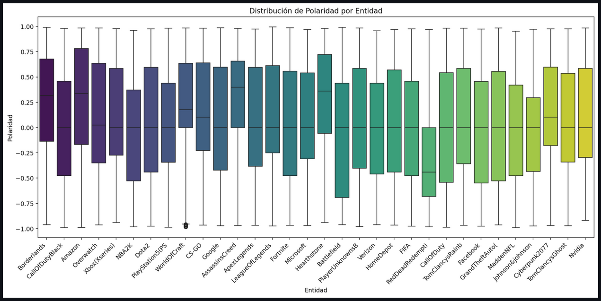
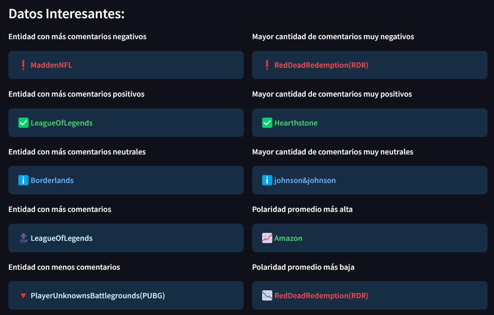

# Análisis de Sentimientos de Tweets

Este repositorio contiene varios proyectos, siendo el principal el `Final_Project`, que se enfoca en el análisis de sentimientos de tweets. A continuación, se proporciona una descripción detallada de cada carpeta y sus contenidos.

## Estructura del Repositorio

- `3rd week`
  - `Employee.py`: Proyecto independiente relacionado con la gestión de empleados.

- `Final_Project`
  - `data_frames`
    - `twitter_comments_ready2go.csv`: Dataset con comentarios de Twitter previamente procesados.
    - `twitter_training.csv`: Dataset sin procesamiento previo.
  - `photos`: Carpeta para almacenar fotos relacionadas con el readme.
  - `main.py`: Archivo principal que contiene el código para realizar el análisis de sentimientos de tweets. (Ver detalles abajo)
  - `requirements.txt`: Archivo de requisitos para ejecutar el proyecto

- `Maze`
  - `ej.py`: Proyecto independiente relacionado con la resolución de laberintos mediante bfs.

- `Readme.md`: Información adicional y documentación para el proyecto de Streamlit.

## Final_Project

El `Final_Project` es un análisis interactivo de sentimientos de tweets utilizando la biblioteca `streamlit` para la visualización de datos y `nltk` para el analisis de sentimientos. El archivo principal, `main.py`, realiza las siguientes funciones:

### Funcionalidades

1. **Carga de Datos**:
   - Permite al usuario seleccionar entre datasets previamente procesados (`twitter_comments_ready2go.csv`), sin procesamiento (`twitter_training.csv`), o cargar su propio dataset.

> [!NOTE]
> El dataset El formato del dataset a cargar debe incluir una primera columna llamada `entity` (la cual contendrá las entidades sobre las cuales los usuarios han escrito) y una segunda columna llamada `content` (la cual contendrá el contenido de los tweets en texto plano relacionado con una entidad en específico)


2. **Análisis de Sentimientos**:
   - Utiliza el analizador de sentimientos de `nltk` para evaluar la polaridad (positivo/negativo) y neutralidad de los tweets.
   - Los resultados se almacenan en nuevas columnas en el dataset (`polaridad`, `neutralidad`, `polaridad_desc`, `neutralidad_desc`).

3. **Visualización de Datos**:
   - Genera gráficos de barras para mostrar la distribución de polaridad y neutralidad de los tweets en general y para entidades específicas.
   - Muestra gráficos de caja para visualizar la distribución de polaridad por entidad.

4. **Datos Interesantes**:
   - Muestra información interesante como la entidad con más comentarios negativos, positivos, neutrales, entre otros.

### Cómo Ejecutar el Proyecto

1. **Clonar el repositorio**:

```
git clone https://github.com/cStoneDev/python-course.git
cd python-course/Final_Project
```

2. **Instalar las dependencias**:

> Asegúrate de tener pip y un entorno virtual configurado. Luego, instala las dependencias:

```
pip install -r requirements.txt
```

3. **Ejecutar la aplicación**:

```
streamlit run main.py
```

### Uso de la Aplicación

1. Al iniciar la aplicación, se te pedirá que selecciones un dataset desde la barra lateral.

2. Puedes elegir entre:
  - Tweets con procesamiento previo
  - Tweets sin procesamiento previo
  - Dataset propio (subir un archivo CSV)

3. Una vez cargado el dataset, la aplicación decidirá si hacer el análisis de sentimientos (si se selecciona un dataset propio o sin procesamiento) y mostrará visualizaciones interactivas.

4. Puedes ver datos interesantes y analizar sentimientos por entidad desde la barra lateral.

### Preview de la aplicación

#### **Panel principal**:


#### **Distribución general de sentimientos**:


#### **Distribución de polaridad por entidad**:


#### **Datos de interés**:

